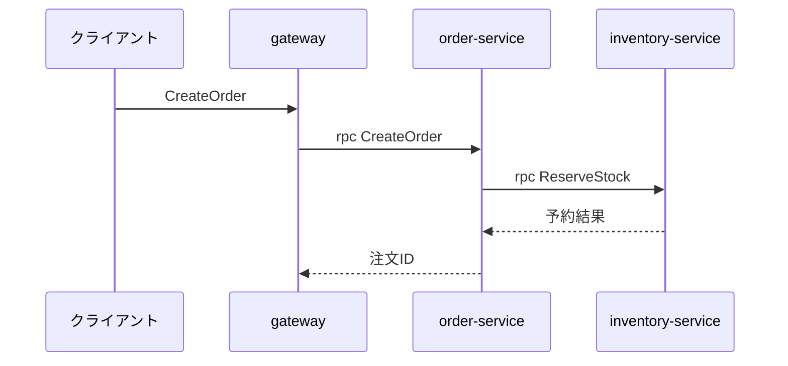

# サービス間フローの追跡

複数リポジトリ・複数サービスにまたがる1本の処理の流れを、**実際のコードを根拠に**追跡する。

## 原則

- **推測で図を描かない**。各ホップは必ず該当ファイルの行を引用できる状態にする
- 見つからなかった経路は「未確認」と明示する。埋めて分かった風にしない
- 生成されたコード(`*.pb.go`、`*_gen.go`等)は経路の証拠にはなるが、**実装の本体ではない**。
  必ず手書きの実装まで辿る
- 調べ終わったら最後に**mermaidのフロー図**と**ファイルパス一覧**を出す

## 追跡の手順

### 1. 入口を特定する

ユーザーが渡してきた名前が何なのかで探し方を変える。

| 渡されたもの | 最初に探す場所 |
|-------------|--------------|
| RPCメソッド名 | `*.proto`の`rpc <名前>` |
| GraphQLのクエリ・ミューテーション名 | `*.graphql`の`type Query`/`type Mutation`、federationなら`@key`付きの型 |
| HTTPパス | gatewayのルーティング定義、`http.HandleFunc`、ミドルウェア設定 |
| 画面の操作・機能名 | まずフロントの呼び出し箇所(`query`/`mutation`/`fetch`)から入る |

```shell
# 例: RPC名から入る
rg -n "rpc <名前>" --glob "*.proto"
# 例: GraphQLのフィールドから入る
rg -n "<名前>" --glob "*.graphql" --glob "*.gql"
```

### 2. 契約(スキーマ)を読む

- protoなら: `service`定義・リクエスト/レスポンスのmessage・importしている共通proto
- GraphQL federationなら: どのサブグラフがそのフィールドを所有しているか(`@key`・`extend type`)を確認する。
  **gatewayは実装を持たない**ので、必ず所有サブグラフまで辿る

### 3. gateway・BFFの経路を辿る

```shell
# gatewayがどのサービスへ振っているか(サービス名・URL・ポートで探す)
rg -n "<サービス名>" --glob "!*.pb.go" -g '!vendor'
rg -n "grpc.Dial|NewClient|ServiceURL|_SERVICE_ADDR" -g '!vendor'
```

- 環境変数でエンドポイントが決まっていることが多い。`docker-compose.yml`・k8sマニフェスト・
  `.env`系も見て、**論理名 → 実サービス**の対応を確定させる

### 4. 実装サービスを特定する

```shell
# protoのserviceインターフェースを実装している型を探す
rg -n "func \(.*\) <RPCメソッド名>\(" -g '*.go'
```

- 生成コード(`*_grpc.pb.go`)ではなく、**ハンドラの実体**を見つける
- 見つけたら、その関数が呼んでいるユースケース層・リポジトリ層まで1段掘る

### 5. 下流を辿る

実装サービスがさらに別サービス・DB・キューを呼んでいれば、2〜4を繰り返す。
**循環や再入がないか**も確認する(あれば図に明示する)。

```shell
# 下流呼び出しの手がかり
rg -n "Client\.|Publish|Enqueue|db\.|Query\(|Exec\(" <実装ファイル>
```

### 6. 成果物を出す

以下の3点をまとめて提示する。

1. **フロー図**(mermaid)



2. **ホップごとの根拠**(表)

| # | 何が起きるか | ファイル:行 |
|---|------------|-----------|
| 1 | rpc定義 | `microservices/order/proto/order-service.proto:42` |
| 2 | gatewayが振り分け | `gateway/router.go:88` |
| 3 | ハンドラ実装 | `microservices/order/internal/handler/order.go:120` |

3. **未確認の箇所**があれば箇条書きで明示する

## 補助ツール

```shell
# 稼働中のgRPCサービスから直接スキーマを引く(reflectionが有効な場合)
grpcurl -plaintext localhost:50051 list
grpcurl -plaintext localhost:50051 describe <サービス名>

# protoの全体像・破壊的変更の確認
buf ls-files
buf breaking --against '.git#branch=main'
```

## 調査を早くするコツ

- `rg`は`-g '!vendor' -g '!*.pb.go'`で生成物とvendorを除くと当たりが良くなる
- サービス数が多い時は、まず`ls`でサービス一覧を取り、名前から当たりを付ける
- 同じ調査を繰り返しそうなら、結果を`CLAUDE.md`(`/claude-md-init`で生成)に追記して次回に活かす
